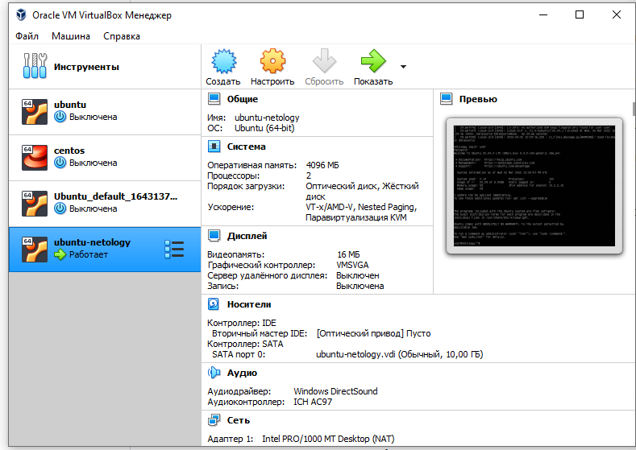
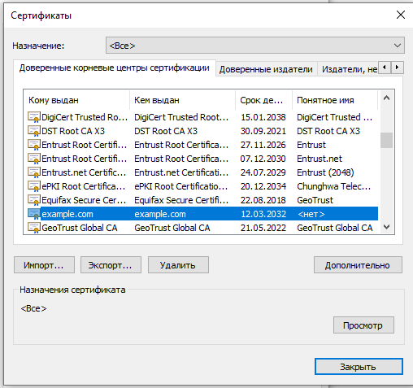
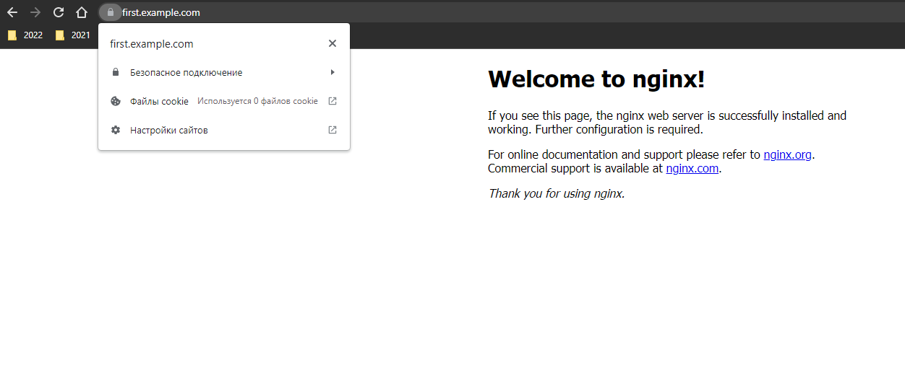

## Курсовая работа по итогам модуля "DevOps и системное администрирование"
1. **Создайте виртуальную машину Linux.**
   
2. **Установите ufw и разрешите к этой машине сессии на порты 22 и 443, при этом трафик на интерфейсе localhost (lo) должен ходить свободно на все порты.**  
   `ufw --version`   
   ufw 0.36    
   Copyright 2008-2015 Canonical Ltd.     
   `sudo ufw allow 22`  
   `sudo ufw allow 443`   
   `sudo ufw allow from 127.0.0.0/8`   
   `sudo ufw allow in on lo`   
   `sudo ufw allow out on lo`   
   `sudo ufw enable`   
   Firewall is active and enabled on system startup   
   
3. **Установите hashicorp vault ([инструкция по ссылке](https://learn.hashicorp.com/tutorials/vault/getting-started-install?in=vault/getting-started#install-vault)).**  

`curl -fsSL https://apt.releases.hashicorp.com/gpg | sudo apt-key add -`   
OK    
`sudo apt-add-repository "deb [arch=amd64] https://apt.releases.hashicorp.com $(lsb_release -cs) main"`  
`sudo apt-get update && sudo apt-get install vault`   
`vault --version`    
Vault v1.9.4 (fcbe948b2542a13ee8036ad07dd8ebf8554f56cb)

4. **Cоздайте центр сертификации по инструкции ([ссылка](https://learn.hashicorp.com/tutorials/vault/pki-engine?in=vault/secrets-management)) и выпустите сертификат для использования его в настройке веб-сервера nginx (срок жизни сертификата - месяц).**

`vault server -dev -dev-root-token-id root`  

Открываем новый терминал и продолжаем работать в нем.    

`export VAULT_ADDR=http://127.0.0.1:8200`  
`export VAULT_TOKEN=root`  
`vault secrets enable pki`  
Success! Enabled the pki secrets engine at: pki/      
`vault secrets tune -max-lease-ttl=87600h pki`  
Success! Tuned the secrets engine at: pki/      

```bash
vault write -field=certificate pki/root/generate/internal \
     common_name="example.com" \
     ttl=87600h > CA_cert.crt
```
```bash
vault write pki/config/urls \
     issuing_certificates="$VAULT_ADDR/v1/pki/ca" \
     crl_distribution_points="$VAULT_ADDR/v1/pki/crl"
```
Success! Data written to: pki/config/urls    
`vault secrets enable -path=pki_int pki`  
Success! Enabled the pki secrets engine at: pki_int/     
`vault secrets tune -max-lease-ttl=43800h pki_int`  
Success! Tuned the secrets engine at: pki_int/  
`sudo apt install jq`
```bash
vault write -format=json pki_int/intermediate/generate/internal \
     common_name="example.com Intermediate Authority" \
     | jq -r '.data.csr' > pki_intermediate.csr
```
```bash
vault write -format=json pki/root/sign-intermediate csr=@pki_intermediate.csr \
     format=pem_bundle ttl="43800h" \
     | jq -r '.data.certificate' > intermediate.cert.pem
```
`vault write pki_int/intermediate/set-signed certificate=@intermediate.cert.pem`    
Success! Data written to: pki_int/intermediate/set-signed

```bash
vault write pki_int/roles/example-dot-com \
     allowed_domains="example.com" \
     allow_subdomains=true \
     max_ttl="500h"
```
Success! Data written to: pki_int/roles/example-dot-com

`vault write -format=json pki_int/issue/example-dot-com common_name="first.example.com" ttl="500h" > first.example.com.json_data`      

5. **Установите корневой сертификат созданного центра сертификации в доверенные в хостовой системе.**  
   Копируем CA_cert.crt на физическую машину и добавляем в "доверенные корневые центры сертификации":  
   
   
6. **Установите nginx.**  
   `sudo apt install nginx`   
   `nginx -v`  
   nginx version: nginx/1.18.0 (Ubuntu)
   
7. <b>По инструкции ([ссылка](https://nginx.org/en/docs/http/configuring_https_servers.html)) настройте nginx на https, используя ранее подготовленный сертификат:
- можно использовать стандартную стартовую страницу nginx для демонстрации работы сервера;
- можно использовать и другой html файл, сделанный вами;</b>

`mkdir /etc/nginx/ssl`  
`cat first.example.com.json_data | jq -r .data.certificate > /etc/nginx/ssl/first.example.com.crt`    
`cat first.example.com.json_data | jq -r .data.issuing_ca >> /etc/nginx/ssl/first.example.com.crt`    
`cat first.example.com.json_data | jq -r .data.private_key > /etc/nginx/ssl/first.example.com.key`    

Открываем конфиг Nginx: /etc/nginx/sites-available/default, и редактируем:
```
server {
	listen 443 ssl;
	server_name first.example.com;
	ssl_certificate	/etc/nginx/ssl/first.example.com.crt;
	ssl_certificate_key /etc/nginx/ssl/first.example.com.key;
	#...
}
```
`systemctl restart nginx`

8. **Откройте в браузере на хосте https адрес страницы, которую обслуживает сервер nginx.**  
   В свойствах сети виртуальной машины ставим: тип подключения "Сетевой мост". Смотрим IP ВМ.  
   
   Прописываем на физической машине в файле hosts 	192.168.0.178	first.example.com, и смотрим в браузере что все ок:
   
   
9. <b>Создайте скрипт, который будет генерировать новый сертификат в vault:
- генерируем новый сертификат так, чтобы не переписывать конфиг nginx;
- перезапускаем nginx для применения нового сертификата.</b>  
  `nano /home/dimon/cert-upd-ngx.sh`
```bash
#!/usr/bin/env bash
logfile=cert-upd-ngx.log
certjsonfile=cert_data.json
cd /home/dimon/
export VAULT_ADDR=http://127.0.0.1:8200
export VAULT_TOKEN=root
date >> $logfile
vault write -format=json pki_int/issue/example-dot-com common_name="first.example.com" ttl="500h" > $certjsonfile 2>>$logfi>
if [ "$?" -eq "0" ]
then
cat $certjsonfile | jq -r .data.certificate > /etc/nginx/ssl/test.example.com.crt
cat $certjsonfile | jq -r .data.issuing_ca >> /etc/nginx/ssl/test.example.com.crt
cat $certjsonfile | jq -r .data.private_key > /etc/nginx/ssl/test.example.com.key
systemctl restart nginx
echo New certificate successfully issued >> $logfile
cat $certjsonfile | jq -r .data.serial_number >> $logfile
rm $certjsonfile
else
        echo Error occurred while issuing new certificate >> $logfile
fi
```  
`chmod +x /home/dimon/cert-upd-ngx.sh`
10. **Поместите скрипт в crontab, чтобы сертификат обновлялся какого-то числа каждого месяца в удобное для вас время.**  
    `crontab -e`  
    `50 20 20 * * /home/dimon/cert-upd-ngx.sh`

`cat cert-upd-ngx.log`
```
Вс 20 мар 2022 20:50:01 MSK
New certificate successfully issued
78:29:7e:e6:ed:dc:16:d3:28:64:28:9c:58:42:c3:aa:f2:e4:56:59
```