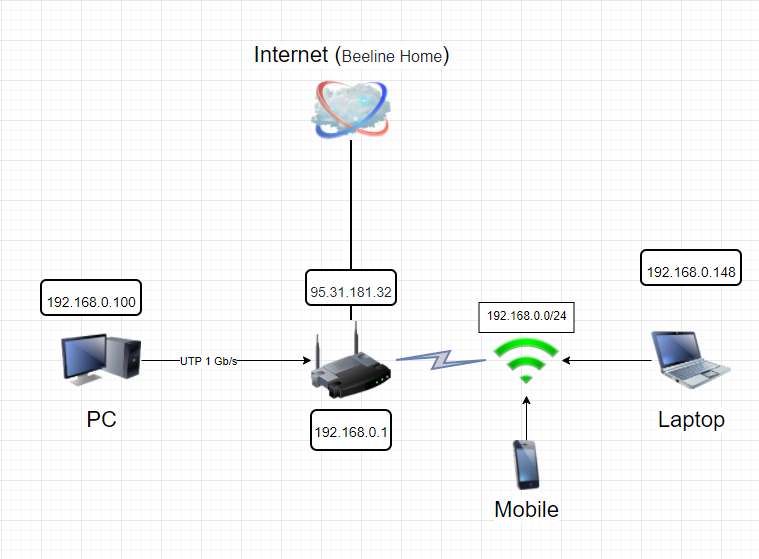

# DevOps Netology HW 3.8

### Вопрос 1. 
#### Ответ:
```
route-views>show ip route 95.31.181.32
Routing entry for 95.30.0.0/15
  Known via "bgp 6447", distance 20, metric 0
  Tag 6939, type external
  Last update from 64.71.137.241 1w4d ago
  Routing Descriptor Blocks:
  * 64.71.137.241, from 64.71.137.241, 1w4d ago
      Route metric is 0, traffic share count is 1
      AS Hops 3
      Route tag 6939
      MPLS label: none
```
### Вопрос 2.
#### Ответ:
* echo "dummy" >> sudo /etc/modules
* echo "options dummy numdummies=2" > sudo /etc/modprobe.d/dummy.conf
* sudo nano /etc/network/interfaces
```
auto dummy0
iface dummy0 inet static
address 10.2.2.2/32
pre-up ip link add dummy0 type dummy
post-down ip link del dummy0
```
* sudo ifup dummy0

* sudo ip route add 8.8.8.8/32 via 10.0.2.2
* sudo ip route add 8.8.8.0/24 via 10.0.2.3
```
vagrant@vagrant:~$ ip route show
default via 10.0.2.2 dev eth0 proto dhcp src 10.0.2.15 metric 100
8.8.8.0/24 via 10.0.2.3 dev eth0
8.8.8.8 via 10.0.2.2 dev eth0
10.0.2.0/24 dev eth0 proto kernel scope link src 10.0.2.15
10.0.2.2 dev eth0 proto dhcp scope link src 10.0.2.15 metric 100
```
### Вопрос 3.
#### Ответ:
ss -tpl
```
Netid  State   Recv-Q  Send-Q                                Local Address:Port                  Peer Address:Port   Process
tcp    LISTEN  0       128                                         0.0.0.0:ssh                        0.0.0.0:*       users:(("sshd",pid=856,fd=3))
tcp    LISTEN  0       4096                                        0.0.0.0:sunrpc                     0.0.0.0:*       users:(("rpcbind",pid=603,fd=4),("systemd",pid=1,fd=37))
```
### Вопрос 4.
#### Ответ:
ss -upl
```
State          Recv-Q         Send-Q                  Local Address:Port                     Peer Address:Port         Process
UNCONN         0              0                       127.0.0.53%lo:domain                        0.0.0.0:*             users:(("systemd-resolve",pid=604,fd=12))
UNCONN         0              0                      10.0.2.15%eth0:bootpc                        0.0.0.0:*             users:(("systemd-network",pid=401,fd=19))
```

### Вопрос 5.
#### Ответ:
