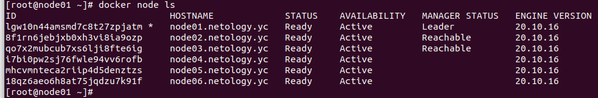
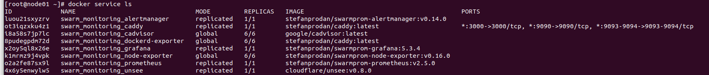

# DevOps Netology HW 5.5 "Оркестрация кластером Docker контейнеров на примере Docker Swarm."

### Вопрос 1. 
#### Ответ:
Дайте письменые ответы на следующие вопросы:

<b>В чём отличие режимов работы сервисов в Docker Swarm кластере: replication и global?</b>
Режим replication указывает, что экземпляров описанного контейнера в кластере docker-swarm может быть сколько угодно, 
а режим global - по одному экземпляру контейнера на каждой ноде.

<b>Какой алгоритм выбора лидера используется в Docker Swarm кластере?</b>
Raft

<b>Что такое Overlay Network?</b>
Overlay сеть это виртуальная подсеть создаваемая кластером docker-swarm для связи контейнеров между собой (даже если они находятся на разных хостах). 
Также таким образом при необходимости обеспечивается сетевое разделение сервисов, что в свою очередь положительно влияет на безопасность.

### Вопрос 2.
#### Ответ:
```
docker node ls
```



### Вопрос 3.
#### Ответ:
```
docker service ls
```

